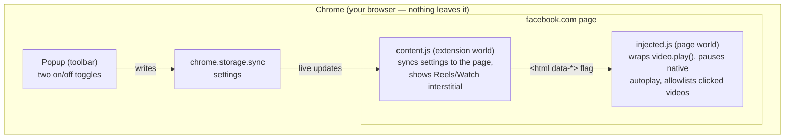

# FB Video Block

A tiny Chrome extension that stops Facebook from sucking you into videos:

- **Hide videos completely** — every video post on facebook.com (feed videos, ads, the Reels shelf, the Stories tray) is collapsed into a small "🎬 Video hidden" note before you even see it. Whole posts are hidden — including ones that only show a play-button thumbnail so far — by detecting Facebook's feed-unit wrappers, video permalinks, and player containers. Deliberately no per-video reveal button.
- **Block autoplay** — any video that is visible (e.g. with hiding toggled off) stays paused until you *deliberately click it*. Facebook's player degrades gracefully (you just see its normal play button).
- **Block Reels & Watch pages** — opening `/reel/…`, `/reels`, or `/watch` shows a full-screen "Videos are blocked here" screen with a **Take me back** button. No escape hatch.

All three protections are on by default; the toolbar popup's toggles are the only way through. Settings sync across your Chrome profile.

> **Important:** after installing or updating, reload any Facebook tabs that were already open — Chrome doesn't inject extensions into pre-existing tabs.

## Install (and share with friends)

No web store needed:

1. Download `fb-video-block.zip` (from this repo's [Releases](../../releases), or run `npm run package`) and unzip it — or just grab the `extension/` folder.
2. Open `chrome://extensions` in Chrome.
3. Turn on **Developer mode** (top-right toggle).
4. Click **Load unpacked** and pick the unzipped folder.
5. Reload any open Facebook tabs. Done.

To share it, send someone the zip plus steps 2–5. Works in Chrome, Edge, Brave, and Arc.

## How it works



Two scripts cooperate on every Facebook page (including `blob:`/`about:blank` player sub-frames):

- `injected.js` runs in the page's own JavaScript world at document start. It wraps `HTMLMediaElement.prototype.play` to reject non-user-initiated plays with the same `NotAllowedError` the browser's autoplay policy uses, and pauses anything that starts via the native `autoplay` attribute. A click on a video (or its player controls) allowlists that one video.
- `content.js` runs in the extension's isolated world. It watches the DOM for `<video>` elements and collapses each player (the outermost still-player-sized wrapper, so posts stay intact) into a small placeholder note; it also mirrors your settings onto the page via a `data-` attribute, watches Facebook's soft SPA navigations, and injects the interstitial on Reels/Watch URLs.

**Privacy:** no network calls, no analytics, no data collection. The only permission is `storage` (for the two toggles), scoped to `facebook.com`.

## Services & infrastructure

None — this is a fully client-side browser extension. No backend, no database (no Convex project needed), no hosting.

## Cost

$0. There are no cost-generating resources.

## Development

```bash
npm install
npm run icons      # regenerate extension/icons/*.png
npm run test:unit  # vitest (pure logic, jsdom)
npm run test:e2e   # Playwright: loads the real extension into Chromium
npm run package    # build dist/fb-video-block.zip for sharing
```

The e2e suite loads the actual unpacked extension into Chromium against local fixture pages that imitate Facebook's player (a live video stream plus aggressive `play()` retries every 200 ms), and asserts that autoplay stays blocked, a real click unblocks, and reel URLs get the interstitial. Both suites run in GitHub Actions on every PR and must pass before merge.
