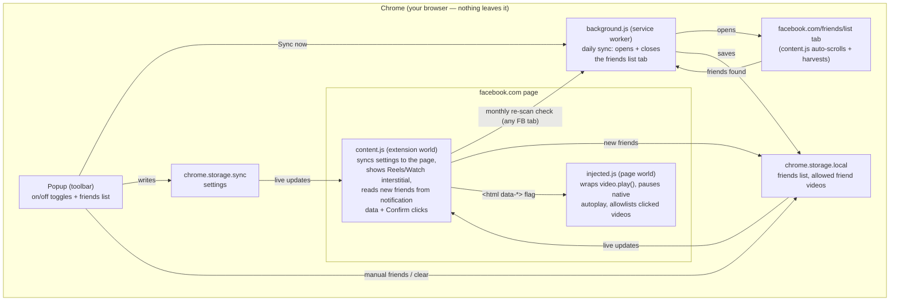

# FB Video Block

A tiny, free, open-source Chrome extension that stops Facebook from sucking you into videos:

- **Hide videos completely** — every video post on facebook.com (feed videos, ads, the Reels shelf, the Stories tray) is collapsed into a small "🎬 Video hidden" note before you even see it. Whole posts are hidden — including ones that only show a play-button thumbnail so far — by detecting Facebook's feed-unit wrappers, video permalinks, and player containers. Deliberately no per-video reveal button.
- **Block autoplay** — any video that is visible (e.g. with hiding toggled off) stays paused until you *deliberately click it*. Facebook's player degrades gracefully (you just see its normal play button).
- **Block Reels & Watch pages** — opening `/reel/…`, `/reels`, or `/watch` shows a full-screen "Videos are blocked here" screen with a **Take me back** button. No escape hatch.

- **Show videos from friends** — your friends' video posts, Stories and Reels stay visible (their Reels open when you click through; strangers' still get the block screen).
- **Friends-only feed** — every News Feed post that isn't from a friend (pages, groups, suggestions, ads) is removed completely, with no placeholder.

**Friends list:** click **Sync from Facebook** in the popup. It opens facebook.com/friends/list, scrolls the whole list by itself, saves your friends (name + profile id/username) and closes the tab. After that it **keeps itself up to date** (popup toggle "Keep it up to date", on by default):

- **New friends are added as they happen.** Facebook embeds your recent notifications as JSON in every page; "*Name* accepted your friend request." entries are read (with profile id + username) on any Facebook page you open. Requests *you* accept send no notification, so clicking **Confirm** on a friend request (right-rail box, requests page, notifications) adds that person.
- **A full re-scan runs monthly** in a background tab, to drop unfriended people and catch friends added elsewhere (e.g. on your phone). A complete re-scan replaces the list; one that comes back much shorter than before (page didn't fully load) only adds. You can also just open the friends list yourself and scroll it. You can also type names or profile links in the popup, one per line. Everything stays in `chrome.storage.local` on your machine. Both friend options are on by default but stay dormant until a friends list exists, so a fresh install never empties your feed. Posts are matched on the author's profile link or name, Stories/Reels cards on their "Jane Doe's story" / "Reel by Jane Doe" labels (English UI).

**Marketplace is never affected:** no hiding, autoplay blocking, or friend filtering on `/marketplace`, and Marketplace boxes in the feed survive friends-only.

All protections are on by default; the toolbar popup's toggles are the only way through. Settings sync across your Chrome profile.

> **Important:** after installing or updating, reload any Facebook tabs that were already open — Chrome doesn't inject extensions into pre-existing tabs.

## Install

No web store needed — it takes about a minute:

1. Download `fb-video-block.zip` from the [latest release](../../releases/latest) and unzip it.
2. Open `chrome://extensions` in Chrome.
3. Turn on **Developer mode** (top-right toggle).
4. Click **Load unpacked** and pick the unzipped folder.
5. Reload any open Facebook tabs. Done.

Works in Chrome, Edge, Brave, Arc, and other Chromium browsers. To update to a new version, remove the old one first, then repeat these steps.

## How it works



Two scripts cooperate on every Facebook page (including `blob:`/`about:blank` player sub-frames):

- `injected.js` runs in the page's own JavaScript world at document start. It wraps `HTMLMediaElement.prototype.play` to reject non-user-initiated plays with the same `NotAllowedError` the browser's autoplay policy uses, and pauses anything that starts via the native `autoplay` attribute. A click on a video (or its player controls) allowlists that one video.
- `content.js` runs in the extension's isolated world. It watches the DOM for `<video>` elements and collapses each player (the outermost still-player-sized wrapper, so posts stay intact) into a small placeholder note; it also mirrors your settings onto the page via a `data-` attribute, watches Facebook's soft SPA navigations, and injects the interstitial on Reels/Watch URLs.

**Privacy:** no network calls, no analytics, no data collection. The only permission is `storage` (for the toggles and your friends list, which never leaves your browser), scoped to `facebook.com`.

## Services & infrastructure

None — this is a fully client-side browser extension. No backend, no database (no Convex project needed), no hosting.

## Cost

$0. There are no cost-generating resources.

## Development

```bash
npm install
npm run icons      # regenerate extension/icons/*.png
npm run test:unit  # vitest (pure logic, jsdom)
npm run test:e2e   # Playwright: loads the real extension into Chromium
npm run package    # build dist/fb-video-block.zip for sharing
```

The e2e suite loads the actual unpacked extension into Chromium against local fixture pages that imitate Facebook's player (a live video stream plus aggressive `play()` retries every 200 ms) and its feed DOM (`data-virtualized` unit wrappers), and asserts that video posts are hidden, autoplay stays blocked, and reel URLs get the interstitial. Both suites run in GitHub Actions on every PR and must pass before merge.

Facebook changes its DOM regularly; if something starts slipping through, please open an issue (a screenshot plus a "save page as… webpage, complete" snapshot of the offending page is the fastest way to get it fixed).

## License

[MIT](LICENSE)
